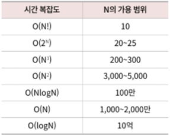

# 공부 노트 

### 시간복잡도

int, long, double, float = 프리미티브 타입
Integer, Long .. = 레퍼런스 타입(연산속도 느림)

앱실론(부동소수점 연산 오차) 연산에 주의하자 
double epsilon = 1E-5;
a == b  => 결과가 이상
Math.abs(a-b) < epsilon => 앱실론 사용시 연산이 정확함

컬랙션 프레임워크 = 레퍼런스 타입 사용(Integer, Long ... )

문자열 = 불변객체, 연산속도가 느림
-> StringBuffer, StringBuilder 사용하기

노하우
조기반환 : 실행과정이 다 도달하기전 반환하자
보호구문: 예외처리 확실히
제네릭: 타입안정성, 타입을 강제하자, 원시사용하지 말자

### 자바 자료구조
- Hashset 
- Stream 
- Stack, Queue? 